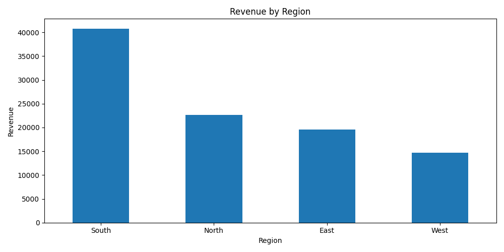
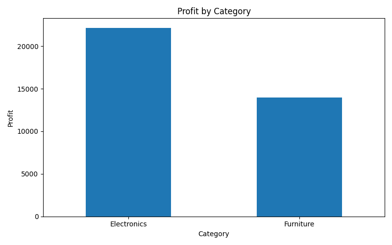
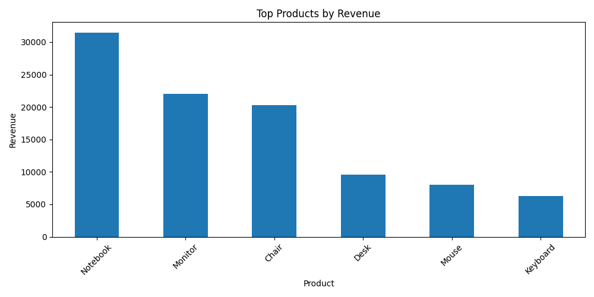
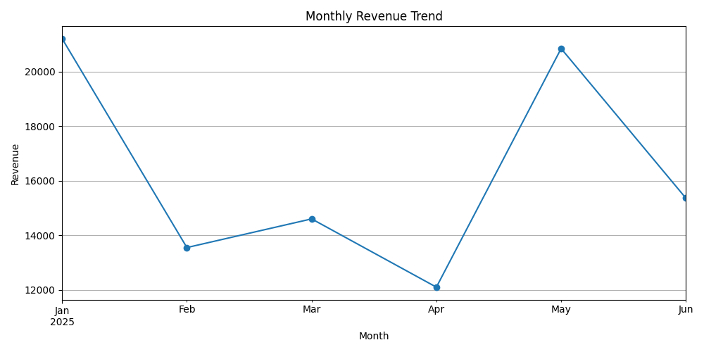

# Business Intelligence Dashboard

This project performs an exploratory business intelligence analysis using Python.

The objective is to analyze revenue, profit, product performance, customer type, and monthly trends to generate business insights.

---

# Technologies Used

- Python
- Pandas
- Matplotlib
- Jupyter Notebook

---

# Dataset

The dataset contains:

- date
- region
- category
- product
- units sold
- unit price
- unit cost
- customer type

---

# Business Metrics Analyzed

The project includes analysis of:

- total revenue
- total profit
- units sold
- revenue by region
- profit by category
- top products by revenue
- revenue by customer type
- monthly revenue trend

---

# Revenue by Region



---

# Profit by Category



---

# Top Products by Revenue



---

# Monthly Revenue Trend



---

# Key Insights

- The South region showed strong revenue performance.
- Electronics generated the highest profit.
- Premium products such as Notebook and Monitor had a major impact on revenue.
- Corporate customers contributed significantly to business results.
- Revenue varied across months, showing trend changes over time.

---

# Project Structure

```bash
business-intelligence-dashboard
│
├── data
│   └── business_data.csv
├── images
│   ├── revenue_by_region.png
│   ├── profit_by_category.png
│   ├── top_products.png
│   └── monthly_revenue.png
├── notebooks
│   └── analysis.ipynb
├── README.md
└── requirements.txt
---

# Author

Lucas Abreu Godoi